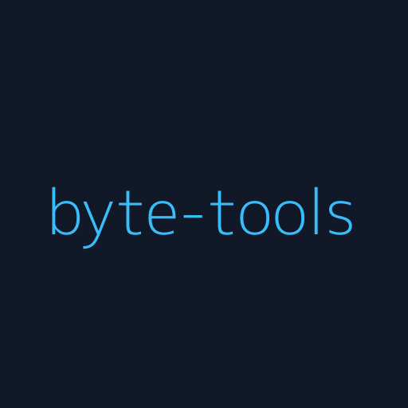
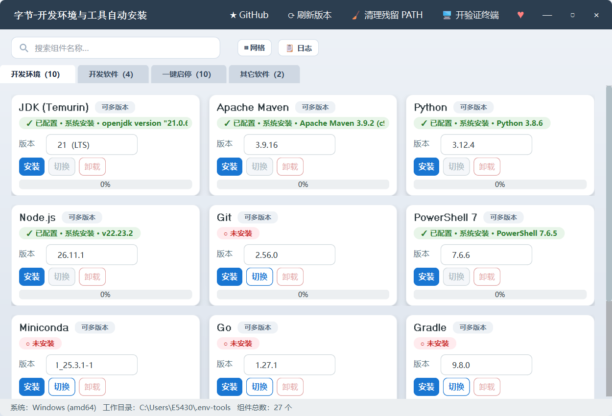

# 字节-开发环境与工具自动安装 (ByteTools)

<p align="center">
   
</p>

<p align="center">
  一款基于 <b>Python + PySide6</b> 的跨平台桌面 GUI 工具<br/>
  覆盖 <b>JDK、Python、Node.js、Maven、MySQL、Docker</b> 等 <b>26 个</b>常用开发组件，<b>一键安装</b>并<b>自动配置环境变量</b>，装完即用<br/>
  <b>Tomcat、Nginx、Kafka、Jenkins</b> 等 <b>10 个</b>服务另支持<b>一键启停</b>与<b>访问页直达</b>，访问地址、账号密码等自动输出到日志
</p>

<p align="center">
  
  
  
  
  <a href="https://github.com/jilong2026/byte-tools/releases"></a>
</p>

---

## 📥 下载即用（推荐）

> **不需要 Python 环境，不需要克隆源码，双击即可运行。**

请到 **[Releases 页面](https://github.com/jilong2026/byte-tools/releases/latest)** 下载对应操作系统的最新版本：

| 系统 | 下载文件 | 说明 |
|------|----------|------|
| 🪟 **Windows** | [`ByteTools.exe`](https://github.com/jilong2026/byte-tools/releases/latest/download/ByteTools.exe) | 双击运行，无需安装 |
| 🍎 **macOS (Apple Silicon)** | [`ByteTools-macos-arm64.zip`](https://github.com/jilong2026/byte-tools/releases/latest/download/ByteTools-macos-arm64.zip) | 解压后双击 `ByteTools.app` |
| 🐧 **Linux (x64)** | [`ByteTools-linux-x64`](https://github.com/jilong2026/byte-tools/releases/latest/download/ByteTools-linux-x64) | `chmod +x` 后直接运行 |

> **Intel 芯片 Mac 用户注意**：自 v1.0.5 起不再提供 Intel 通用包（GitHub 已下线 Intel runner），Intel 机器请参考下方[快速开始](#-快速开始)从源码运行。

### 首次启动提示

- **macOS**：由于未做代码签名，首次打开时系统可能提示"无法验证开发者"。请到「系统设置 → 隐私与安全性」下方点击 **"仍要打开"**；或用 `xattr -cr ByteTools.app` 移除隔离属性。
- **Windows**：Defender / SmartScreen 可能弹出"未识别应用"，点击 **"更多信息 → 仍要运行"** 即可。
- **Linux**：如果双击无响应，请在终端执行 `chmod +x ByteTools-linux-x64 && ./ByteTools-linux-x64`。

> 💡 只想看看代码 / 自己二次开发？往下翻到 [开发者指南](#-快速开始)。

---

## 📖 目录

- [下载即用](#-下载即用推荐)
- [开发背景](#-开发背景)
- [项目描述](#-项目描述)
- [功能特性](#-功能特性)
- [支持的组件](#-支持的组件)
- [环境要求](#-环境要求)
- [快速开始](#-快速开始)（源码开发者）
- [使用说明](#-使用说明)
- [截图预览](#-截图预览)
- [配置与自定义](#-配置与自定义)
- [目录结构](#-目录结构)
- [常见问题（FAQ）](#-常见问题faq)
- [技术栈](#-技术栈)
- [支持作者](#-支持作者)
- [许可证](#-许可证)

---

## 🌱 开发背景

每次入职新公司、拿到一台新电脑、或者给同事讲解怎么搭建后端 / 前端开发环境，都要重复一系列繁琐的步骤：

1. **找官网** —— Oracle 现在要登录才能下 JDK？Adoptium Temurin 是哪个包才对？MySQL 官方的 zip 藏在哪个二级页面？
2. **对系统 / 架构** —— macOS 是 Intel 还是 Apple Silicon？Linux 用 glibc 哪个版本？
3. **解压 + 放到"正确"的位置** —— 一堆 `C:\Program Files\...` 还是 `~/tools/...` 的目录规划。
4. **配置环境变量** —— Windows 上要点开"高级系统设置 → 环境变量 → 用户变量 / 系统变量 → 新建"；macOS/Linux 要区分 `.zshrc`、`.bash_profile`、`.bashrc`、`.profile` 里到底写在哪个才生效。
5. **验证** —— 打开新终端 `java -version`、`mvn -v` …… 一个不对就重来。

一台电脑做完至少半小时，多台电脑或者带新人上手时更是重复劳动。**能不能把这些交给一个工具？** 于是有了这个项目：

> 让「新机器 → 一套完整开发环境」这件事变成 **点几下鼠标** 就搞定。

---

## 📌 项目描述

**ByteTools**（原名 byte-tools）是一款开源的桌面小工具，目标是把开发者最常用的语言运行时、构建工具、中间件的下载与配置全部自动化。

它做了这几件事：

- ✅ **智能识别系统**：自动判断 Windows / macOS / Linux + CPU 架构（x64 / arm64），挑选正确的官方分发包
- ✅ **动态版本抓取**：启动时向各官方 API / 归档索引拉取最新可用版本列表（Adoptium、Apache Maven / Tomcat、python.org、Node.js dist、GitHub Releases、Anaconda Repo），不再依赖硬编码
- ✅ **可搜索下拉框**：版本列表长？直接键入 `21` / `3.12` / `LTS` 实时过滤
- ✅ **自动检测已装环境**：如果系统已经有 `java` / `mvn` / `python`，会显示 ✓ 已配置 状态并禁用「切换」按钮，避免重复写入
- ✅ **一键下载 → 解压 → 配环境变量**：Windows 下走 `winreg`，macOS/Linux 下带 marker 幂等写入 shell 配置文件
- ✅ **安装器模式**：Miniconda 这类 `.exe` / `.sh` 安装器，工具会以静默参数自动执行安装
- ✅ **现代化 UI**：无边框自定义标题栏、可切换网格 / 列表的卡片式布局、渐变进度条、彩色分级日志（浮层，可收起）、状态胶囊标签

---

## ✨ 功能特性

| 特性 | 说明 |
|------|------|
| 🖥️ **跨平台** | 一份代码同时支持 Windows / macOS / Linux；ARM64 分支自动切换（如 Apple Silicon 下 JDK 走 aarch64、Node 走 arm64） |
| 📦 **一键装配** | 内置 **26 个** 常用开发组件，从下载 → 解压 → 环境变量配置全流程自动化 |
| ▶️ **一键启动 + 打开控制台** | 自带控制台的组件不必再自己敲启动命令：卡片上点「启动」即拉起，「控制台」直接用浏览器进到它自己的页面（当前支持 **Tomcat、Nginx、ActiveMQ、RocketMQ、Kafka、Elasticsearch、Seata、Nacos、RabbitMQ、Jenkins** 共 10 个）。端口被占用时按既定策略**结束占用者**并在确认框里说清楚（不平移端口 —— 平移会让外部客户端连不上）；「停止」停不下来时只询问是否强制结束，不会背着你强杀。状态以**端口整簇是否都在听**为准（Nacos 的主口 + gRPC、Kafka 的 9092+9093、RocketMQ 的 namesrv+broker 都算），关掉工具重开也能认出现在正在跑什么，且识别状态的过程绝不执行任何启动脚本。✅ **已在 Windows 真机逐个验证**：10 个组件每一个都完成「下载安装 → 启动 → 整簇端口监听 → 控制台/协议探活（如 `rabbitmqctl status`、Kafka `BrokerApiVersions`）→ 停止 → 端口释放」，由 497 条离线用例 + 真机矩阵（`bt_live_matrix.py`）共同守护。**macOS 与 Linux 尚未真机验证**，详见 [DEVELOPMENT.md](./DEVELOPMENT.md) 规则 R5 |
| 🧩 **前置运行时自动就位** | 需要 JDK 的组件（Jenkins / Nacos / Kafka / RocketMQ / ActiveMQ / Tomcat / Seata）在宿主上**没有 JDK 或版本太低**时，点「启动」会先自动下载安装一个够用的 JDK，再继续启动；RabbitMQ 需要的 Erlang/OTP 同理（按 RabbitMQ 版本自动配 27.x / 26.x）。**用户不需要自己去装任何前置依赖**，也不需要手改任何文件。详见 [DEVELOPMENT.md](./DEVELOPMENT.md) 规则 R6 |
| 🌐 **每件启动完都有页面可看** | 启动成功后组件日志里会打出醒目的访问地址（含**实际端口**与启动日志路径），卡片上也有「控制台 / 访问页」按钮：自带 Web 界面的直接进它自己的页面（Nginx 首页 :8888、Tomcat 首页 :8081、Nacos / Seata / ActiveMQ 控制台、Jenkins）；Kafka / RocketMQ / RabbitMQ 这类**协议端口型（浏览器打开必然失败）**的组件，由工具自带的小服务给一张「启动成功」页 —— 写着运行状态、端口、访问方式、登录信息与日志路径，**服务停掉后刷新会自动变成「已停止」**，不会留一张永远说"成功"的假告示。详见 [DEVELOPMENT.md](./DEVELOPMENT.md) 规则 R10 |
| 🚫 **平台不支持时会说清楚** | 有 2 个组件在 Windows 上**没有可用的免安装形态**：`Docker`（官方 static binary 只发 Linux/macOS，Windows 必须装 Docker Desktop）与 `Pulsar`（主命令只有 POSIX shell 脚本，官方起步要求 Docker 或 WSL）。卡片上会写明原因并给出替代做法，**不会**先装一个跑不起来的东西再让用户自己猜 |
| 🇨🇳 **国内镜像优先** | v2.0 起内置 **11 家大陆镜像基址**（华为云 repo / 华为云 mirrors / 清华 TUNA / 阿里云 / 南大 / 中科大 / 北外 / 腾讯云 / 上交 / npmmirror / DaoCloud files）+ **3 个 GitHub 加速器**（**ghfast.top / gh-proxy.com / ghproxy.net**，2026-10-08 实测按速度排序，实测约 751 / 133 / 14 KB/s），多源故障转移，全部失败后才回退官网，全程中文日志，**无需手动改 URL**。个别组件没有大陆源：mongodb、postgresql 官网单源；nacos、bun、powershell、erlang 与 git 的 macOS/Linux 源码包走 GitHub 加速器；nginx 的 Windows zip 实测只有华为云两个子域同步（清华 / 北外 / 南大 / 阿里 / 腾讯均 404）；kubectl 优先 DaoCloud 代理；seata 走 Apache 分发目录（八家大陆镜像）。详见「配置与自定义 → 更换下载镜像」 |
| 🛡️ **下载可靠性** | 所有请求固定携带专用 User-Agent（部分高校镜像站会屏蔽默认 UA 返回 403）；下载完成后校验实际字节数，遇到镜像站"假 200 空文件"自动换下一个源，不会留下坏包 |
| 🌐 **动态版本抓取** | 后台线程并发调用各组件官方 API / 索引，拉取最新可用版本，抓取失败自动降级到内置默认清单 |
| 🔍 **智能检测** | 优先检查 `XXX_HOME` 环境变量，然后回退到 `PATH` 中的可执行文件；探测到即视为已配置 |
| 🎯 **可搜索下拉框** | 版本多？直接键入关键字实时过滤，回车即可选中 |
| 🔎 **组件搜索框** | 26 个组件不必逐页翻：Tab 上方的搜索框按名称 / 标识**全组件模糊过滤**；搜索时收起四个 Tab、把命中组件按分类归并到同一结果列表（带分类小标题），一眼看全、不用切页，清空即恢复四个 Tab |
| 🛠️ **环境变量写入** | Windows：`winreg` 直写注册表 + 广播 `WM_SETTINGCHANGE`（对资源管理器**同步点名**发送，其余窗口后台广播；不用 `setx`，避免 1024 字符截断）；macOS/Linux：写入带标记的 shell 配置块，幂等更新 |
| 🔀 **多版本并存 + 生效版本切换** | JDK / Python / Node.js / Go / Maven / Gradle / Bun 这 **7 个**组件可以把多个版本同时装在本地（`~/.env-tools/<组件>/<组件>-<版本>/`），并在界面上显式指定其中一个为**生效版本**：点「切换」就是切换生效版本，切换时把本组件在 `PATH` 里的条目收敛成生效版本那一条，任一步失败自动回滚到切换前状态，不会留下"变量指 A、`PATH` 指 B"的半套配置。下拉框里带**绿色对勾**的版本 = 磁盘上已经装好 |
| 🧹 **卸载与残留清理** | 卸载以磁盘上真正装着的目录为准。**多版本组件只删下拉框选中的那一个版本**：只删该版本的目录与它自己的 PATH 条目，同组件其它版本一动不动；`XXX_HOME` 也只在它正指向被删版本时才清。只有该组件已无任何已装版本时，才回到按组件目录整体清扫（手工删过安装目录留下的死条目也能一并清掉）。标题栏「清理残留 PATH」可一键删除指向本工具目录但已不存在的死条目 |
| 🧭 **接管你自己装的版本 + 一键还原** | 机器上原有、放在本工具目录之外的 JDK / Maven / Node 等同样能被扫描出来并设为生效版本（扫描只读、逐个真跑版本命令确认）。用户级改不动时才会弹确认框、在**系统 `PATH` 最前**插入目标目录；改动前先存原文快照，卡片上常驻「↩ 还原到我之前的设置」按原文逐字写回。五道硬规则（原文快照 / 最小编辑 / 关键条目校验 / 复验 / 可还原）缺一不执行，任何一步不过就自动回滚，绝不报"成功"却没生效。**本工具自己装的版本被系统级老版本压住时（用户级永远压不住系统段）同样会问一次并插到系统 `PATH` 最前**，不再让你自己去手改系统变量 |
| 🚀 **安装器模式** | 支持 `.exe` / `.sh` 静默安装（Miniconda），无弹窗交互 |
| 📊 **实时反馈** | 进度条显示下载速度和大小，可随时取消；日志浮层彩色分级输出（warn / error 会自动弹开并在「📋 日志」按钮上挂未读条数） |
| 🎨 **现代化界面** | 圆角卡片 + 阴影（按窗口宽度自适应网格排布，可切「▦ 网格 / ☰ 列表」）、渐变进度条、状态胶囊标签、无边框自定义窗口、窗口图标（任务栏/Alt+Tab 可见）、底部状态栏显示"组件总数：26 个" |
| 🧠 **偏好记忆** | 记住上一次每个组件选择的版本，下次启动自动恢复 |
| 💰 **打赏支持** | 内置微信 / 支付宝 / QQ 二维码，一键支持作者 |

---

## 📦 支持的组件

> 组件数 **26 个**，覆盖语言运行时 / Shell / 构建工具 / 应用服务器与 Web 服务 / 数据库 / 容器与编排 / CI/CD / 消息队列 / 服务发现 / 搜索引擎 / 版本控制 / Python 发行版等常见开发场景。

界面按 **四个 Tab 页**（顶部横向，标题自带组件数量）分组展示（下方小节仍按技术类别详述），Tab 上方另有一条**搜索框**可按名称模糊过滤组件：

| Tab | 数量 | 归类标准 | 组件 |
|-----|------|----------|------|
| **开发环境** | 10 | 装完进 PATH，直接用来写 / 编译 / 打包代码 | JDK、Python、Node.js、Go、Bun、Miniconda、Git、Maven、Gradle、PowerShell 7 |
| **开发软件** | 4 | 本地跑起来给项目当依赖、但本工具还不能一键启停的服务 | MySQL、MongoDB、PostgreSQL、Pulsar |
| **一键启停** | 10 | 卡片上有「启动 / 停止」按钮，点下去真的能跑起来（成员由启动白名单 `LAUNCH_KEYS` 派生） | Tomcat、Nginx、RabbitMQ、Kafka、RocketMQ、ActiveMQ、Nacos、Seata、Elasticsearch、Jenkins |
| **其它软件** | 2 | 不参与写代码的容器 / 编排外围 | Docker、kubectl |

> 想调整归类：普通组件改 `main.py` 里 `COMPONENT_CATEGORY_OF` 的一行即可；
> 「一键启停」那一页不用登记 —— 组件进了启动白名单 `LAUNCH_OF` 就自动出现在那里，退出来就自动回到原分类。

### 语言运行时

| 组件 | 显示名 | 环境变量 | 检测命令 | 默认版本 |
|------|--------|----------|----------|----------|
| **JDK** | JDK (Temurin) | `JAVA_HOME` | `java -version` | 21 / 17 (LTS) / 11 / 8（下载前先点"⟳ 刷新版本"，详见表格下方提示） |
| **Python** | Python | — (走 PATH) | `python --version` | 3.12 / 3.11 / 3.10 / 3.9 |
| **Node.js** | Node.js | `NODE_HOME` | `node --version` | 20 LTS / 18 LTS / 16 |
| **Go** | Go (golang) | `GOPATH` / `GOROOT` | `go version` | 1.24.x / 1.22.x |
| **Bun** | Bun | — (走 PATH) | `bun --version` | 1.x |
| **PowerShell 7** | PowerShell 7 | — (走 PATH) | `pwsh --version` | 7.6.x / 7.5.x / 7.4.x（三平台都有官方便携包：Windows zip、Linux / macOS tar.gz；上游只在 GitHub Releases 发版，实测无国内真镜像，走 GitHub 加速器） |

### 构建工具

| 组件 | 显示名 | 环境变量 | 检测命令 | 默认版本 |
|------|--------|----------|----------|----------|
| **Maven** | Apache Maven | `MAVEN_HOME` | `mvn -v` | 3.9.x / 3.8.x |
| **Gradle** | Gradle | `GRADLE_HOME` | `gradle -v` | 8.x / 7.x |

### 应用服务器

| 组件 | 显示名 | 环境变量 | 检测命令 | 默认版本 |
|------|--------|----------|----------|----------|
| **Tomcat** | Apache Tomcat | `CATALINA_HOME` | `catalina version` | 10.1 / 9.0 / 8.5 |
| **Nginx** | Nginx | — (走 PATH) | `nginx -v` | 1.31.x / 1.30.x / 1.28.x（⚠️ 仅 Windows 支持自动下载：官方只给 Windows 发预编译 zip，Linux / macOS 上游是源码包，请用 `apt / dnf / yum install nginx` 或 `brew install nginx`；国内镜像实测只有华为云两个子域同步了 zip） |

### 数据库

| 组件 | 显示名 | 环境变量 | 检测命令 | 默认版本 |
|------|--------|----------|----------|----------|
| **MySQL** | MySQL Server | `MYSQL_HOME` | `mysql --version` | 8.0.x（阿里 / 华为云镜像 + 官网） |
| **MongoDB** | MongoDB | — (走 PATH) | `mongod --version` | 8.0.x / 8.0.0（支持 Windows / Linux；⚠️ macOS 不支持自动下载，请用 `brew install mongodb-community`；实测无国内镜像，官网单源） |
| **PostgreSQL** | PostgreSQL | `PG_HOME` | `psql --version` | 17.x / 16.x（⚠️ 仅 Windows 支持自动下载，Linux 请用发行版包管理器、macOS 请用 `brew install postgresql`；实测无国内镜像，官网单源） |

### 容器与编排

| 组件 | 显示名 | 环境变量 | 检测命令 | 默认版本 |
|------|--------|----------|----------|----------|
| **Docker** | Docker Desktop | — (走 PATH) | `docker --version` | 27.x / 26.x（⚠️ Windows 不支持自动下载，须用安装器，请去 docker.com 手动下载） |
| **kubectl** | Kubernetes CLI | — (走 PATH) | `kubectl version --client` | 1.31.x / 1.30.x（三平台均支持；优先 DaoCloud 代理源；Linux/macOS 下载的是无扩展名单文件，需 `chmod +x` 后运行） |

### CI/CD

| 组件 | 显示名 | 环境变量 | 检测命令 | 默认版本 |
|------|--------|----------|----------|----------|
| **Jenkins** | Jenkins | `JENKINS_HOME` | `jenkins --version` | 2.x / LTS |

### 消息队列

| 组件 | 显示名 | 环境变量 | 检测命令 | 默认版本 |
|------|--------|----------|----------|----------|
| **RabbitMQ** | RabbitMQ | `RABBITMQ_HOME` | `rabbitmqctl version` | 4.0.x / 3.13.x（⚠️ Windows 不支持自动下载，依赖 Erlang，请去 rabbitmq.com 手动下安装器） |
| **Apache Kafka** | Apache Kafka | `KAFKA_HOME` | `kafka-server-start.sh --version` | 4.1.x / 3.9.x |
| **Apache RocketMQ** | Apache RocketMQ | `ROCKETMQ_HOME` | `mqadmin version` | 5.x |
| **Apache Pulsar** | Apache Pulsar | `PULSAR_HOME` | `pulsar version` | 3.x |
| **ActiveMQ** | Apache ActiveMQ | `ACTIVEMQ_HOME` | `activemq --version` | 6.3.x / 5.18.x |

### 服务发现 / 事务

| 组件 | 显示名 | 环境变量 | 检测命令 | 默认版本 |
|------|--------|----------|----------|----------|
| **Nacos** | Nacos | `NACOS_HOME` | `sh startup.sh -m standalone` | 2.x（发布在 GitHub Releases，无真镜像，走 ghproxy.net / gh-proxy.com / ghfast.top 加速） |
| **Seata** | Seata | `SEATA_HOME` | `sh seata-server.sh -h` | 2.x（走 Apache 分发目录，华为云 / 清华 / 阿里 / 南大 / 北外 / 腾讯 / 中科大等八家大陆镜像） |

### 搜索引擎

| 组件 | 显示名 | 环境变量 | 检测命令 | 默认版本 |
|------|--------|----------|----------|----------|
| **Elasticsearch** | Elasticsearch | `ES_HOME` | `elasticsearch --version` | 9.x / 8.x（华为云镜像 + 官网；镜像只同步新版本，老版本由故障转移兜底） |

### 版本控制

| 组件 | 显示名 | 环境变量 | 检测命令 | 默认版本 |
|------|--------|----------|----------|----------|
| **Git** | Git | — | `git --version` | MinGit for Windows（华为云 / npmmirror 国内源优先）/ macOS、Linux 不提供自动下载（上游只有源码包，界面提示用 apt / dnf / yum / brew 安装） |

### Python 发行版

| 组件 | 显示名 | 环境变量 | 检测命令 | 默认版本 |
|------|--------|----------|----------|----------|
| **Miniconda** | Miniconda | `CONDA_HOME` | `conda --version` | py312 / py311 / py310 |

> 💡 启动应用后，点 **"⟳ 刷新版本"** 按钮会从各组件官方源拉取最新版本列表。抓取失败会自动回退到硬编码的内置清单，保证程序在离线环境下也可用。JDK 请特别注意：清华 / 南大镜像上要带 build 号的确切文件名，只有"刷新版本"后才能解析出来——**先点刷新，再下载**。

---

## 💻 环境要求

- **Python**：3.10 – 3.14（PySide6 6.11 声明 `requires_python >=3.10,<3.15`）；Windows 用户不必手工安装，两个一键脚本会自动发现、必要时静默装一个
- **操作系统**：Windows 10 / 11、macOS 12+、Ubuntu 20.04+
- **网络**：需要能访问对应组件的下载源（如 Apache 归档、Adoptium API、Node.js dist 等）
- **磁盘**：视安装的组件而定，建议预留 3 GB 以上（JDK+Maven+Node+Python+MySQL 加起来约 1.5-2 GB）

---

## 🚀 快速开始

> 📌 **本节面向开发者 / 想二次开发的用户**。只想使用工具？请回到 [下载即用](#-下载即用推荐)。

### 0. Windows 用户一键启动（推荐）

项目根目录下提供两个中文一键脚本，**双击即可运行**，无需任何命令行操作：

| 脚本 | 作用 |
| --- | --- |
| `一键启动项目.bat` | 准备环境后直接启动 GUI（源码方式，改完代码立刻生效） |
| `一键打包exe.bat` | 准备环境后调用 PyInstaller，产出 `dist/ByteTools.exe` |

两者共用同一套自动装配流程：

1. 先看 `.venv` 是不是已经能用；能用就直接跳过找解释器这一步，不浪费流量
2. 找可用的 Python（**3.10 – 3.14**，与 PySide6 的 `requires_python` 对齐）：`py -3.12/3.13/…` → `python`/`python3` → `%LOCALAPPDATA%\Programs\Python\*` 与 `%ProgramFiles%\Python*` 目录扫描。**一个都没有就自己装**：先 `winget`，再按 **华为云 → npmmirror → python.org** 的顺序下载官方安装包静默安装（用户级、无需管理员、不写 PATH）
3. 复用已有的 `.venv`；缺失或损坏时自动创建 / 重建（`--clear`）
4. 依赖缺失时安装 `requirements.txt`，镜像顺序 **清华 TUNA → 阿里云 → 官方 PyPI**；打包脚本额外安装 PyInstaller
5. 启动 `main.py`，或按 `byte-tools.spec` 打包并在结束时显示产物大小与时间

```text
双击 一键启动项目.bat  →  自动配置 + 启动 GUI
双击 一键打包exe.bat   →  自动配置 + 生成 dist/ByteTools.exe
```

> 💡 脚本只读写项目目录内的 `.venv`，不会修改系统 PATH，也不会动系统全局 Python。
> 只有在本机一个可用 Python 都没有时，它才会在**当前用户的** `%LOCALAPPDATA%\Programs\Python` 下装一份 3.12（用户级、不写 PATH、不需要管理员权限）。
> 想脚本化调用可加参数 `nopause`（跑完不等待按键）。

### 手动方式（macOS / Linux 用户或想自定义者）

#### 1. 克隆项目

```bash
git clone https://github.com/yourname/byte-tools.git
cd byte-tools
```

#### 2. 创建虚拟环境（推荐）

```bash
python -m venv .venv

# Windows
.venv\Scripts\activate

# macOS / Linux
source .venv/bin/activate
```

#### 3. 安装依赖

```bash
pip install -r requirements.txt
```

依赖清单：

- `PySide6` — Qt for Python，提供跨平台 GUI
- `requests` — HTTP 请求，用于下载文件和抓取版本列表

#### 4. 启动应用

```bash
python main.py
```

首次启动会自动创建工作目录：

```
~/.env-tools/          # 所有下载的压缩包 / 解压后的组件都放这里
├── jdk/
│   ├── downloads/     # 原始压缩包
│   └── jdk-17/        # 解压后的 JDK
├── maven/
├── node/
└── ...
```

---

## 📝 使用说明

### 基本流程

1. **打开应用** → 主界面会显示所有支持的组件卡片，每个卡片右上角会显示 **当前系统检测结果**：
   - 🟢 `✓ 已配置（PATH）· openjdk version "17.0.10"` — 系统已能找到，无需再装
   - 🟠 `● 已下载，未配置` — 本地已有安装包，但环境变量未设置
   - 🔴 `○ 未安装` — 完全没有
   - 支持多版本的 7 个组件（JDK / Python / Node.js / Go / Maven / Gradle / Bun）用另一套标签，把"装了哪几个、哪个生效"一次说清：
     - 🟢 `● 已装 2 个版本 · 生效 21（21、17）` — 括号里是磁盘上已装的版本清单（版本号从新到旧），`生效 21` 是当前生效版本
     - 🟠 `● 已装 2 个版本 · 均未生效（21、17）` — 装了版本，但系统的 `XXX_HOME` / `PATH` 没有指向其中任何一个
     - 🔴 `○ 未安装` — 一个版本都没装
     - 随后异步探测到生效版本的精确版本号，会补在末尾：`● 已装 2 个版本 · 生效 21（21、17） · 21.0.4`

2. **选择版本** → 点击版本下拉框：
   - 直接从列表点击选择
   - 或者输入关键字（如 `21`、`3.12`、`LTS`）实时过滤
   - 版本名前面带**绿色对勾**的表示这个版本磁盘上已经装好了；没有对勾的就是还没装（多版本组件才有这个对勾）

3. **点击"安装"**（一条龙流程） → 工具会自动依次执行：
   - ⬇️ 流式下载到 `~/.env-tools/<组件>/downloads/`（国内镜像优先、失败自动换源，可随时取消）
   - 📂 解压到 `~/.env-tools/<组件>/<组件>-<版本>/`（Miniconda 走静默安装器）
   - 🔧 自动写入 `XXX_HOME` 环境变量 + 把 `bin` 追加到 `PATH`
   - 🔄 自动刷新该卡片状态（无需再手动点「切换」）
   - 🔁 同一组件的旧版本目录**不会被删除**，装第二个版本就是多版本并存；安装时会把环境变量指向刚装的这个版本，想让卡片上的「生效」明确落在它身上、并把本组件在 `PATH` 里的多条条目收敛成一条，再点一次「切换」即可
   - 🚫 下拉框选中的版本**磁盘上已经装着**时，「安装」是灰的，鼠标停上去会提示"要重新安装请先点「卸载」"（26 个组件都适用，避免把已装好的目录覆盖掉；想重装就先卸载再装）

4. **或点击"切换"**：
   - **多版本组件**：把下拉框选中的那个版本设为**生效版本**（写 `XXX_HOME`，并把本组件在 `PATH` 里的条目收敛成生效版本这一条）。选中的版本已经是生效版本时按钮是灰的，鼠标停上去会提示"要换版本先在下拉框里选中"
   - **其他组件**：只在本地已解压的目录里挑版本号最高的那个来配置环境变量，不重新下载（适合已手动下载好压缩包的场景）

5. **查看日志** → 点搜索条上的「📋 日志」展开日志浮层，实时显示每一步的执行情况（有 warn / error 时会自动弹开）

### 多版本组件与「生效版本」

JDK / Python / Node.js / Go / Maven / Gradle / Bun 这 7 个组件支持把多个版本同时留在机器上，
每个版本一个目录：`~/.env-tools/<组件>/<组件>-<版本>/`（例：`~/.env-tools/jdk/jdk-21`、`jdk-17` 并存）。
界面上用「生效版本」这个概念指明"系统现在实际在用哪一个"。

- **绿色对勾 = 磁盘上已装**：下拉框里带勾的版本可以直接点「卸载」，不带勾的点了也没东西可删，所以「卸载」按钮是灰的
  （鼠标停在按钮上会提示"先在下拉框里选中带勾的版本"）
- **已装版本一定会出现在下拉框里**：镜像的在线清单是会更新的，某个版本可能已经被挪出清单但你磁盘上还装着。
  这种情况下下拉框会把它按版本号大小补回原来的位置并带上绿勾——不然这种版本既选不中、也切不了、还卸不掉，
  只能手工删目录。补进来的条目只对 7 个多版本组件生效，其它组件的下拉清单保持在线清单原样
- **「切换」= 把选中的版本设为生效版本**：改 `XXX_HOME` 指向该版本目录，并把本组件在 `PATH` 里的条目
  收敛成生效版本那一条，其它组件和你自己的条目都不动。切换中途任何一步失败都会按切换前的状态自动回滚，
  日志里会写清回滚结果，不会出现"`XXX_HOME` 指 21、`PATH` 指 17"这种半套配置
- **卸载只动选中的那个版本**：只删该版本的目录与它自己的 `PATH` 条目，同组件其它版本的目录、变量、条目一概不碰。
  卸载摘要里会逐条写明做了什么，例如：`已删除安装目录：…jdk-21`、`已删除环境变量：JAVA_HOME`、
  `已从 PATH 移除：…jdk-21\bin`、`PATH 中没有本次卸载范围的条目`
- **删掉的正是生效版本时会自动重排**：日志出现 `生效版本已自动切到 17.0.12`（换成剩余版本里版本号最高的那个）；
  生效版本本身还在、只是环境变量被这次卸载带偏时，则是 `已按生效版本 21.0.4 重建环境变量与 PATH`；
  把该组件的最后一个已装版本删掉时是 `已无安装版本，生效登记已清除`
- **你自己装的、放在本工具目录之外的那份 JDK/Python 不会被动到**：`XXX_HOME` 指向本工具组件目录之外时，
  卸载既不删它、也不把它改成别的版本，日志会写明这份变量"未删除"。删掉生效版本后的自动重排同样只在本工具
  自己的组件目录范围内进行，绝不接管你放在目录之外自己装的那一份
- **老配置也能用**：这个功能上线前就装好的组件，卡片按系统里现有的 `XXX_HOME` 判断哪个版本生效；
  点一次「切换」后就以界面登记的为准
- 本工具**不**改写你项目里的 `pom.xml` / `build.gradle`，也不做 IDE 内的 SDK 配置——多版本靠"生效版本"这一层解决，
  IDE 里要指定某个 JDK 时请到 IDE 自己的 SDK 设置里填对应版本的目录

### 用上「你自己装的那一份」：接管与一键还原

上面那套只管本工具自己下到 `~/.env-tools/` 里的版本。你机器上原来装的 JDK / Maven / Node 等等
（`E:\soft\jdk\jdk17` 这种）同样能被认出来并设为生效版本：

1. **扫描**：在卡片底部展开「系统里检测到的版本」，它会去查环境变量、`PATH` 条目，以及 Python 的
   `py -0p` / 注册表登记。**扫描只读**，不动任何设置 —— 扫描前会提示，展开才开扫。
   每一行都要**真跑一次版本命令**确认才列出来，探测不出来的目录宁可少显示，也不显示一个认错了的
2. **切过去**：先只改用户级环境变量（不弹权限窗口）。改完会**复验**「新终端里第一条命中的到底是谁」：
   - 已经指向目标版本 → 完成；
   - 被更靠前的目录压住（Windows 的进程 `PATH` 是「系统段整体在前 + 用户段整体在后」，只写用户级
     **压不住**系统级同名条目）→ 会先弹一个确认框，逐条列出"要改什么、改成什么、原来是什么"，
     同意后才请求管理员权限，在**系统 `PATH` 最前面插入**目标目录；
   - 拿不到复验结果 → **不升级**，如实报"未能复验，请重开终端确认"
3. **还原**：接管生效后卡片上常驻「↩ 还原到我之前的设置」，按**接管前的原文**逐字写回
   （包括原样恢复 `%JAVA_HOME%` 这类占位符与原来的变量类型）。重启程序后按钮仍在
4. **安全边界**：动系统变量一律"先存原文快照（另存一份备份文件）+ 只在原文上整条插入、不重排不去重
   不改大小写 + 写完重读逐条校验（含 `system32` / `Windows` 的关键条目少一条就立刻回滚）+
   复验 + 可还原"。任何一项不通过就自动还原并如实报错，**不会出现"报成功但实际没生效"**。
   你在 UAC 窗口上点"否"、或助手超时，都按"未做任何改动"处理

外部版本**只出现在这个折叠区里**：不进版本下拉框（下拉框是版本反查的关键），也永远不参与卸载 ——
本工具不删你自己装的东西。这个能力只对 JDK / Python / Node.js / Go / Maven / Gradle / Bun 这 7 个组件开放。

### 如果「切换」不生效：本工具会自己解决，不再让你去手改

还有一种情况不是"接管你自己装的那一份"，而是**本工具装的版本被你系统里的老版本压住**。
本机实测的例子：系统变量 `PATH` 里有你自己装的 `E:\soft\maven\apache-maven-3.9.2\bin`，
而本工具装的 3.10.0 写在用户变量里 —— Windows 合成进程 `PATH` 的规则是
「系统段整体在前 + 用户段整体在后」，所以**用户级怎么写都压不住系统级那条**。

以前这种情况只会打印一句"本工具不改系统级环境变量，请你自己去删掉/后移那条"。
现在改成按**抢命令的那条写在哪一段**分别处理，能自己解决就自己解决：

- **写在用户变量里**（只是排在我们前面）：把本工具那条让到用户变量最前，再复验一次 —— **不弹权限窗口**；
- **写在系统变量里**：弹确认框逐条列出要改什么，同意后才请求管理员权限，**只在系统 `PATH` 最前插入**
  本工具这个版本的目录，**原有条目一条不删**（你自己装的那份仍留在系统变量里，只是排到后面）；改完复验，通过才算成功；
  写完同样会**点名通知资源管理器** —— 提权改动是助手子进程写的注册表，如果主程序不补这一声，
  你会看到"注册表已经对了、软件里的验证终端也是新的，可你自己新开的终端还是旧版本"
- **两边都找不到**：**不弹权限窗口**，如实说明为什么本工具不接手（病灶不在 `PATH` 这两段里，改系统变量也未必对症）。

两种情况都先把改动前的原文存下来，卡片上常驻「↩ 还原到我之前的设置」可一键写回
（还原同样是系统级改动，写完也会通知一次资源管理器，否则"还原之后新开的终端"还会命中被还原掉的那个版本）。
另外，**切换下一个版本、或卸载这个版本之前，本工具都会先把系统变量还原** ——
所以系统 `PATH` 里不会留下指向旧目录、或指向已被删目录的残条。
你在确认框或 UAC 窗口上点"否"，一律按"未做任何改动"处理。

### 环境变量生效方式

- **Windows**：新开命令行/PowerShell 窗口即可读到新的用户变量；已打开的窗口需要重启。
  本工具在每次写完后（**用户变量、以及提权写的系统变量都算**）会**点名通知资源管理器**
  （`Shell_TrayWnd`）让它立刻重建自己那份环境，
  所以从开始栏 / 任务栏 / 桌面新开的终端 1 秒内就是新值
- **还不变就一定是"宿主进程"旧**：Windows 是把环境块**复制**给新进程的。IDE、以及任何常驻程序
  （它们内部再开终端）揣的还是自己启动那一刻的环境，从它们里面开的终端无论重多少次都不会变。
  切换后日志会点名"比这次切换更早、还开着的终端窗口"（含 pid 与启动时间），照着关掉整个窗口即可；
  拿不准就点标题栏 **「🖥 开验证终端」**，那个窗口用的是系统为新进程现算的环境
- **多版本切换同样受这一条约束**：切换生效版本时本工具会立刻把新值同步给自己，但**已经开着的终端和 IDE
  看不到这次改动**——终端要重开窗口，IDE（IntelliJ IDEA / Eclipse / VS Code 等）要整个重启，
  只在 IDE 里新建一个终端标签有时仍然不够。**Windows Terminal 同理**：它的新标签页、新窗口都继承进程启动时
  那份环境块，要的是把整个 Windows Terminal 关掉重开，不是新开一个标签。日志结尾那句"已开着的终端与 IDE 需重开才会读到新值"就是这个意思
- **`where java` 可能仍然先命中 Oracle 的 javapath**：Oracle 的 Java 自动更新会在**系统** `PATH` 里插一条
  `C:\Program Files\Common Files\Oracle\Java\javapath`，而本工具写的是**用户**变量，用户条目排在系统条目之后。
  这种情况下即使 `JAVA_HOME` 已经指到我们装的版本，直接敲 `java -version` 报的仍是 javapath 那份。
  自检命令见下方「验证方法」；确认办法是把系统 `PATH` 里那条 javapath 删掉（需要管理员权限改系统环境变量）
- **macOS / Linux**：

  ```bash
  source ~/.zshrc        # 或 ~/.bashrc / ~/.bash_profile / ~/.profile
  ```

  或直接重开终端

### 验证方法

```bash
java -version
mvn -v
python --version
node -v
mysql --version
git --version
conda --version
```

刚切过多版本组件的生效版本？在**新开**的窗口里跑下面三行，就能确认改的是不是你以为的那一份
（`where` 的输出按 `PATH` 里的先后顺序排列，**第一行才是真正被执行的那个**）：

```bat
echo %JAVA_HOME%
where java
%JAVA_HOME%\bin\java -version
```

- `echo %JAVA_HOME%` 应显示 `C:\Users\<你>\.env-tools\jdk\jdk-<生效版本>`（多版本组件切换后就是它）
- `where java` 的第一行应当落在同一个目录下。若第一行是
  `C:\Program Files\Common Files\Oracle\Java\javapath\java.exe`，说明 Oracle 的 javapath 抢在前面，
  直接敲 `java` 用的还是它（第三条命令用 `%JAVA_HOME%\bin\java` 绕开 `PATH`，可用来确认我们这份没问题）

---

## 📸 截图预览

<p align="center">
  
</p>

界面元素说明：

- **顶部**：自定义标题栏，含应用图标（任务栏/Alt+Tab 可见）、GitHub 链接、刷新版本、清理残留 PATH、**开验证终端**（用系统为新进程合成的环境开一个命令行窗口，在里面查版本 = 在一个全新终端里查）、打赏按钮、窗口控制（最小化 / 最大化 / 关闭）
- **标题栏下方**：组件搜索框（按名称 / 标识模糊过滤，右侧实时显示"匹配 N / 26 个组件"）+ 四个横向 Tab 页，搜索框右侧另有「▦ 网格 / ☰ 列表」视图切换与「📋 日志」开关
- **中部**：每个组件一张卡片，展示名称、状态标签（悬停看完整说明）、版本下拉框（可搜索；多版本组件里磁盘已装的版本带绿色对勾）、操作按钮（安装 / 切换 / 卸载）、进度条。卡片按窗口宽度**自动排成网格**（1000 宽时 3 列 × 3 行，一屏 9 个），可点搜索条上的「▦ 网格 / ☰ 列表」切成单列
- **日志**：默认收起为一层浮在卡片上的浮层，点搜索条上的「📋 日志」展开（出现 warn / error 时会自动弹开并在按钮上挂未读条数）。四色分级输出（info 灰、ok 绿、warn 橙、error 红），全程中文日志（含镜像切换/故障转移过程）
- **状态栏**：显示当前系统信息、工作目录，以及 **"组件总数：26 个"**（一眼掌握支持范围）

---

## 🔧 配置与自定义

### 修改 / 新增组件版本

打开 `main.py`，找到 `build_components()` 函数。每个组件的默认版本列表都在这里。如需新增或调整：

```python
components.append(
    Component(
        key="jdk",
        display_name="JDK (Temurin)",
        env_var="JAVA_HOME",
        path_subdir="bin",
        exec_name="java",
        version_args=["-version"],
        versions=[
            ComponentVersion(
                version=v,
                url_map=_adoptium_jdk_url(v),
                archive_map={"Windows": "zip", "Darwin": "tar.gz", "Linux": "tar.gz"},
            )
            for v in ("22", "21", "17", "11", "8")  # 加入 22
        ],
    )
)
```

> ⚠️ 提示：`versions` 只是**离线默认清单**。启动时后台会自动向官方 API 拉取真实版本，覆盖此清单。你也可以通过修改 `FETCHERS` 字典自定义抓取逻辑。

### 更换下载镜像

> **v2.0 起内置国内镜像优先 + 多源故障转移机制，普通用户无需手动改 URL。** 下面说明仅给想理解机制或做二次开发的用户参考。

工具目前内置 **11 家大陆镜像基址**（华为云 repo / 华为云 mirrors / 清华 TUNA / 阿里云 / 南大 / 中科大 / 北外 / 腾讯云 / 上交 / npmmirror / DaoCloud files），另有 **3 个 GitHub 加速器**（ghproxy.net / gh-proxy.com / ghfast.top；GitHub Releases 没有真镜像，只能走反向代理加速）。下载遵循 **"大陆源在前 → 多源故障转移 → 末位官网回退"** 规则：

1. 按顺序尝试各源，遇到 404 / 超时 / 连接失败立即切换到下一个
2. 全部大陆源失败后才回退到官网地址
3. 全程输出中文日志（哪个源失败、切换到哪个、最终用了哪个）
4. 两条可靠性保障：所有请求固定带 `byte-tools` 自定义 User-Agent（部分高校镜像站会屏蔽默认 UA 返回 403）；下载完成后校验实际字节数，遇到镜像站"假 200 空文件"自动换下一个源，不会留下坏包

少数组件的源策略不一样（2026-09-28 实测结论）：

- **mongodb、postgresql**：实测没有任何大陆镜像，官网单源；
- **nacos、bun、powershell 与 git 的 macOS/Linux 源码包**：无真镜像，走 3 个 GitHub 加速器，末位回退 GitHub 裸地址；
- **nginx**：只有 Windows 有官方预编译 zip，且实测只有华为云两个子域同步了它（清华 / 北外 / 南大 / 阿里 / 腾讯都 404），末位回退 `nginx.org`；Linux / macOS 上游只有源码包，不提供自动下载；
- **kubectl**：首位是 DaoCloud `files.m.daocloud.io` 代理（`dl.k8s.io` 直连路径不可改写，必须走它的 files 代理），末位才是官方 `dl.k8s.io`；
- **seata**：走 Apache 分发目录，华为云 / 清华 / 阿里 / 南大 / 北外 / 腾讯 / 中科大等八家大陆镜像；
- **jdk**：离线默认清单只有官网一条，清华 / 南大镜像的确切文件名要点"⟳ 刷新版本"后才解析——**先点刷新，再下载**。

效果：**国内用户无需手动修改任何 URL** 即可享受国内镜像加速，相比旧版"手动改 URL 函数"的方式体验大幅提升。

> 💡 下载失败时怎么办？先展开日志浮层（「📋 日志」）看是哪个源失败、切到了哪个源；点"⟳ 刷新版本"可以让工具重新解析镜像上的最新版本与文件名，再重试下载。

> 📖 想了解镜像机制的完整技术实现（镜像清单配置、故障转移策略、Nacos/Bun 这类无真镜像组件如何用 GitHub 加速器，以及版本索引页为什么直连官网）？请查阅 [`DEVELOPMENT.md`](./DEVELOPMENT.md) 的 **R1 国内镜像优先规则** 章节。

### 修改工作目录

默认工作目录是 `~/.env-tools/`。在 `main.py` 顶部修改：

```python
CONFIG_DIR = Path.home() / ".env-tools"
```

---

## 📦 自行打包 / 发布新版本

项目已经配置好 PyInstaller 与 GitHub Actions，你可以：

### 本地打包（单平台）

Windows 用户直接双击根目录的 `一键打包exe.bat`（自动准备 `.venv` + PyInstaller）。
手动方式：

```bash
pip install pyinstaller
pyinstaller byte-tools.spec --noconfirm --clean
```

> 💡 如果你的机器上 PyInstaller 一开始跑就长时间没输出（WINMGMT 冷启动，`platform.win32_ver()`
> 卡住不返回），改用仓库里现成的入口，效果相同但全程不查 WMI：
> `python pyinstaller_no_wmi.py byte-tools.spec --noconfirm --clean`。
> 双击 `一键打包exe.bat` 走的已经是这条路径。

产物：
- Windows：`dist/ByteTools.exe`
- macOS：`dist/ByteTools.app`
- Linux：`dist/ByteTools`

> 🎨 Windows 产物已带项目图标（`assets/byte-tools.ico`，由 `assets/byte-tools.png` 转出的 16~256 七档尺寸）。换 logo 后重新生成 ICO 的方法见 [CODE_WIKI.md](./CODE_WIKI.md) 7.4；若覆盖打包后资源管理器仍是旧图标，那是 Windows 图标缓存，改个文件名或执行 `ie4uinit.exe -show` 即可刷新。

### 自动发布三平台版本（推荐）

推一个 tag 到 GitHub，`.github/workflows/release.yml` 会在 Windows / macOS / Linux 三个 runner 上分别打包，自动上传到对应 GitHub Release，并在 Gitee Release 写好产物直链：

```bash
git tag v1.0.1
git push origin v1.0.1
```

几分钟后 GitHub Release 是完整的正式版本；Gitee 侧会有一个 Release，正文用表格列出三个平台产物的 GitHub 直链（**2026-09-29 起 Gitee 不再挂大二进制**，原因见下）。全自动发布，无需手动点 Publish。

**Gitee 同步的可靠性设计**（逻辑在 `同步Gitee产物.sh`）：

- **Gitee 侧默认不接收大二进制**。境外 runner 往 `gitee.com` 推 84MB 会长时间挂死且服务端根本不落地——v1.0.3 实测一次 POST 挂了 70 分钟，Gitee 附件清单里一个产物都没有。改成正文写 GitHub 直链后，这段 job 只剩几个几 KB 的 API 调用。
- 确实要 Gitee 站内直下时：把 workflow 里的 `UPLOAD_ARTIFACTS` 填上要传的文件名（建议只挑小包），并把该 job 的 `runs-on` 换成部署在国内的 `self-hosted` runner；或直接用本机的 `同步Gitee产物.bat`（国内链路快）。
- **每次请求都打可见输出**：HTTP 状态码、耗时、已传字节与均速。4xx 立即判死不做无谓重试，网络类错误按 `MAX_ATTEMPTS`（默认 3 次：5s / 10s）退避。旧写法把 curl 的 `--retry` 与脚本重试相乘、单请求允许 30 分钟，最坏能静默吃掉 6 小时不吐一行日志。
- `sync-to-gitee` job 加了 `timeout-minutes: 25`（此前走 GitHub 默认 360 分钟，是「卡住没人知道」的根子）。
- 脚本幂等：Release 已存在就复用 ID、附件已存在就跳过上传，所以**同步失败后直接 Re-run 该 job 是安全的**。
- **正文缺直链会自己补写**（2026-09-30 修）。历史 Release 的正文可能是旧版本或本机 `.bat` 写的占位串（不含直链），
  那样收尾校验必然失败、且重跑永远修不好（v1.0.5 就卡在这）。现在脚本发现正文缺直链会
  `PATCH /repos/{owner}/{repo}/releases/{id}` 把正文补上（该路由经实测确认：不带令牌返回 401「登录失效」，
  不存在的路径返回 404），补写被拒才回落到"人工粘贴 / 删了重建"的指引。
- 只想补同步历史 tag：Actions → release → **Run workflow** 填 tag（例如 `v1.0.5`），
  它只跑 Gitee 同步、不重新构建。注意 **Re-run 旧的那次运行用的是当时的代码**，改了脚本要新触发一次才生效。
- 收尾强校验：正文里的 GitHub 直链必须回读到位；`UPLOAD_ARTIFACTS` 指定的附件必须全部出现。缺一项就报错，不会静默「同步成功」。
- 令牌只作为 curl 表单字段传递，绝不拼进 URL，脚本也刻意不用 `curl -v`（那会把令牌打进日志）。

### 每次发版的固定三步

推 tag 之后 GitHub 侧全自动，Gitee 侧要你在本机补一步上传（境外 runner 传大二进制会挂死，国内链路只需几十秒）：

1. **推 tag**（改动已推到 master 之后，顺序不能反：workflow 取的是 tag 指向那个 commit 里的版本）

   ```bash
   git tag v1.0.4 && git push origin v1.0.4
   ```

2. **等 Actions 全绿**。这一步之后：GitHub Release 有 3 平台 4 个产物且已正式发布；Gitee 有同名 Release，正文是 GitHub 直链表格，但**附件区还是空的**。
3. **本机取产物并传上 Gitee**（令牌走交互输入，不落命令行历史）

   ```bat
   cd /d E:\file\test\byte-tools
   mkdir release-assets
   curl -L -o release-assets\ByteTools.exe               "https://gh-proxy.com/https://github.com/jilong2026/byte-tools/releases/download/v1.0.4/ByteTools.exe"
   curl -L -o release-assets\ByteTools-windows-x64.zip   "https://gh-proxy.com/https://github.com/jilong2026/byte-tools/releases/download/v1.0.4/ByteTools-windows-x64.zip"
   curl -L -o release-assets\ByteTools-macos-arm64.zip   "https://gh-proxy.com/https://github.com/jilong2026/byte-tools/releases/download/v1.0.4/ByteTools-macos-arm64.zip"
   curl -L -o release-assets\ByteTools-linux-x64         "https://gh-proxy.com/https://github.com/jilong2026/byte-tools/releases/download/v1.0.4/ByteTools-linux-x64"
   dir release-assets
   同步Gitee产物.bat v1.0.4
   ```

   双击 `同步Gitee产物.bat` 也一样：它只会问 tag 和令牌，产物目录默认就是 `release-assets`。脚本幂等，重跑会跳过已存在的附件；跑完 `[3/3]` 会核对四个附件是否都在。

> 想省掉第 3 步：把 `release.yml` 里 `sync-to-gitee` 的 `runs-on` 换成部署在国内的 `self-hosted` runner，并把该 step 的 `UPLOAD_ARTIFACTS` 填上四个产物名，CI 就能全自动把产物传上 Gitee。

### 补同步历史 tag（如 Gitee 侧漏了产物）

v1.0.2 这类「GitHub 成功、Gitee 没同步好」的情况不用重发包。两种方式任选：

**方式一（推荐，零本地依赖）**：GitHub 仓库页面 → Actions → 选择 `release` 工作流 → **Run workflow** → 填写 `tag_name`（如 `v1.0.2`）→ 运行。它只跑同步任务，不重新构建。

> 注意：脚本只在**创建** Gitee Release 时写正文（Gitee 的「更新 Release」接口方法与路径未能在官方文档核实，不去猜着调）。所以补同步一个「Gitee 上已存在但正文没有直链」的老 tag 时，脚本会明确报错并给你两条路子：A) 在 Gitee 网页端把报错里给出的那段正文粘进 Release 编辑框；B) 删掉 Gitee 上这个 Release（含同名 tag），重跑让脚本带直链重建。

**方式二（在本机执行）**：本机网络能直连 Gitee，自己准备产物目录后跑脚本。Windows 用 `.bat`（它会真的把产物传上 Gitee，国内链路快），Linux / macOS / Git Bash 用 `.sh`（默认只写直链，要传东西就设 `UPLOAD_ARTIFACTS`）。

> ⚠️ 产物目录**别用仓库自带的 `assets/`**——那是图标目录（`byte-tools.png` / `.ico` / `alipay.png` / `wechat.png`），`.bat` 会一个产物都找不到。默认值已改成 `release-assets/`（已加进 `.gitignore`，几百 MB 产物不会误入库），且现在会**先检查产物再请求 Gitee**，不会白跑一趟。
>
> ⚠️ 国内直连 `github.com` 取产物会超时（2026-09-29 实测：`curl` rc=28，20 秒连不上；同一时刻 `https://gh-proxy.com/` 前缀返回 206 + 真实文件魔数）。下面的命令都带加速器前缀，`同步Gitee产物.bat` 报错时打印的提示也同样带。

```bat
REM Windows：先用 curl（走加速器）取产物，再跑脚本；令牌建议用交互提示输入
mkdir release-assets
curl -L -o release-assets\ByteTools.exe               "https://gh-proxy.com/https://github.com/jilong2026/byte-tools/releases/download/v1.0.2/ByteTools.exe"
curl -L -o release-assets\ByteTools-windows-x64.zip   "https://gh-proxy.com/https://github.com/jilong2026/byte-tools/releases/download/v1.0.2/ByteTools-windows-x64.zip"
curl -L -o release-assets\ByteTools-macos-arm64.zip   "https://gh-proxy.com/https://github.com/jilong2026/byte-tools/releases/download/v1.0.2/ByteTools-macos-arm64.zip"
curl -L -o release-assets\ByteTools-linux-x64         "https://gh-proxy.com/https://github.com/jilong2026/byte-tools/releases/download/v1.0.2/ByteTools-linux-x64"
dir release-assets       REM 4 个大小要和 GitHub Release 上报的对得上
同步Gitee产物.bat v1.0.2 <Gitee私人令牌> release-assets
```

```bash
# Linux / macOS / Git Bash。同样走加速器前缀，直连 github.com 会超时
mkdir -p ./release-assets
for f in ByteTools.exe ByteTools-windows-x64.zip ByteTools-macos-arm64.zip ByteTools-linux-x64; do
  curl -L -o "./release-assets/$f" "https://gh-proxy.com/https://github.com/jilong2026/byte-tools/releases/download/v1.0.2/$f"
done

# 令牌用 read -s 现问现用，不落进命令行历史和日志
read -rsp "Gitee Token: " GITEE_TOKEN; export GITEE_TOKEN; echo
GITEE_OWNER=jack_liujilong GITEE_REPO=byte-tools TAG_NAME=v1.0.2 \
GITHUB_REPO_SLUG=jilong2026/byte-tools ASSETS_DIR=./release-assets \
"./同步Gitee产物.sh"
unset GITEE_TOKEN
```

> 两个脚本都依赖 `curl`；`.sh` 还需要 `awk`，`python3`/`python` 只用于解析 JSON（选不到可用解释器时回退 `grep`；Windows 上 `python3` 常是 Microsoft Store 的占位别名，脚本已改为先做握手测试再决定用哪个）。`.bat` 文件内容保持纯 ASCII，因为 cmd 会按 GBK 解析 UTF-8 批处理文件，中文会导致语法错乱。

---

## 📁 目录结构

```
byte-tools/
├── main.py                             # 主程序（含 UI 与全部逻辑）
├── 一键启动项目.bat                # 一键脚本：自动装环境（.venv + 依赖）后启动 GUI
├── 一键打包exe.bat                 # 一键脚本：自动装环境后用 PyInstaller 产出 exe
├── pyinstaller_no_wmi.py           # 打包入口：绕开 PyInstaller 导入期/子进程对 WMI 的依赖
├── requirements.txt                    # Python 依赖清单
├── byte-tools.spec                 # PyInstaller 打包配置
├── README.md                           # 中文说明（本文件）
├── README_EN.md                        # 英文说明
├── DEVELOPMENT.md                      # 开发者文档（含 R1 国内镜像优先规则等实现细节）
├── CODE_WIKI.md                        # 代码百科（类 / 模块 / 函数索引）
├── LICENSE                             # MIT 许可证
├── .gitignore                          # Git 忽略规则
├── 同步Gitee产物.sh                # Gitee Release 同步脚本（Linux/macOS/CI，默认只在正文写 GitHub 直链；快速失败 + 幂等 + 校验）
├── 同步Gitee产物.bat               # 本机 Windows 版（双击可运行；它会真的把产物传上 Gitee，国内链路快）
├── .github/
│   └── workflows/
│       └── release.yml                 # 三平台自动构建 + 发布（含 Gitee 同步）
└── assets/                             # 静态资源
    ├── byte-tools-pt.png               # 主界面截图
    ├── byte-tools.png                  # 应用窗口图标
    ├── wechat.png                      # 微信收款码
    └── alipay.png                      # 支付宝收款码
```

---

## ❓ 常见问题（FAQ）

**Q1. 启动后下拉框显示"获取失败"？**
可能是网络原因或访问受限（如 GitHub API 在部分地区不稳定）。工具会自动回退到内置默认版本列表，仍然可以下载安装 —— 只是版本可能不是最新。**默认版本完全可用**。各组件默认就按国内镜像优先下载，源策略见「配置与自定义 → 更换下载镜像」章节。

**Q2. 下载卡在某个百分比不动？**
可能是网络原因或镜像限速。点击 **「取消」** 后重试，工具会自动换下一个源；反复失败时先展开日志浮层（「📋 日志」）看是哪个源失败、切到了哪个源，也可以点"⟳ 刷新版本"重新解析镜像后再试（无需手动改 URL）。

**Q3. 提示环境变量写入失败？**
- Windows：请以"管理员身份"重新启动本程序（默认写入的是**用户级**变量，通常不需要管理员权限）
- macOS / Linux：确认你有 `~/.zshrc` 等文件的写入权限

**Q4. 已经存在旧的 `JAVA_HOME`，会被覆盖吗？**
会用最新一次安装 / 配置写下的路径覆盖原有值；同时把新的 `bin` 目录追加到 `PATH`（同一条目不会重复追加）。
多版本组件点「切换」切换生效版本时更进一步：`JAVA_HOME` 改指生效版本，本组件目录下的其它 `PATH` 旧条目
会被一并收敛掉、只留生效版本那一条（其它组件的条目、你自己放在本工具目录之外的条目都不动）。

**Q5. MySQL 解压完成后能直接用吗？**
不能。MySQL 解压后还需要执行 `mysqld --initialize` 等初始化步骤。本工具只完成"下载 + 解压 + 环境变量"三步，不做数据库初始化。

**Q6. `.tar.xz` 归档能处理吗？**
可以，程序内置了 `tarfile.open("r:xz")` 逻辑（用于 MySQL Linux 版）。

**Q7. Windows 上 PATH 超过 1024 字符怎么办？**
工具不使用 `setx`（它有 1024 字符截断），一律用 `winreg` 直接写入 `HKCU\Environment`，再广播 `WM_SETTINGCHANGE` 通知其他进程（资源管理器那一路是**同步点名**发送的，`HWND_BROADCAST` 那条对它是无效的，详见 `DEVELOPMENT.md` R3.15 / R3.20）；PATH 按单条目增删，不会用注册表的用户段覆盖当前进程的 PATH。

**Q8. Miniconda 静默安装到哪里？**
安装到 `~/.env-tools/conda/conda-<版本>/`，并把 `CONDA_HOME` 与 `bin/Scripts` 加入环境变量。

**Q9. 可以只做检测不做安装吗？**
可以。启动时工具就会检测所有组件的状态；如果所有组件都显示 ✓ 已配置，说明你的系统已经就绪，不需要再点任何按钮。
（支持多版本的那 7 个组件显示的是 `● 已装 N 个版本 · 生效 X（…）`，含义相同：已经就绪。）

**Q10. 支持自动更新组件版本吗？**
点击卡片的下拉框会先看到内置版本，程序启动后后台自动请求官网并热更新列表。所以理论上"最新版本"是实时的（前提是能访问对应官网）。

**Q11. 为什么 Docker 在 Windows 提示"无可用下载地址"？**
Docker Desktop 必须使用其官方安装器（涉及 WSL2 / Hyper-V 集成、服务注册等系统级配置），不能简单走"下载 zip → 解压"流程。工具不会为 Windows 提供自动下载，会直接提示用户去 [docker.com](https://www.docker.com/products/docker-desktop/) 手动下载安装。Mac / Linux 用户则按各自平台正常下载。

**Q12. 为什么 RabbitMQ 在 Windows 不能自动下载？**
RabbitMQ 运行时依赖 Erlang，Windows 上必须先安装 Erlang 再装 RabbitMQ 服务端，属于典型的"安装器+服务注册"场景，超出本工具"binary 下载 + 解压"的范围。工具会引导用户去 [rabbitmq.com](https://www.rabbitmq.com/download.html) 下载官方安装器。

**Q13. 国内下载会很慢吗？**
不会。v2.0 起内置国内镜像优先规则：**11 家大陆镜像基址**（华为云 / 清华 TUNA / 阿里云 / 南大 / 中科大 / 北外 / 腾讯云 / 上交 / npmmirror / DaoCloud 等）+ **3 个 GitHub 加速器**，下载时按顺序尝试，遇到 404 / 超时自动切换下一个源，全程输出中文日志（哪个源失败、切换到哪个、最终用了哪个）。普通用户无需任何手动配置。少数组件没有大陆源：**mongodb、postgresql** 实测无任何大陆镜像，只能官网单源；**nacos、bun、powershell 与 git 的 macOS/Linux 源码包**走 GitHub 加速器；**nginx** 只有 Windows 有官方 zip，且实测只有华为云两个子域同步。kubectl 以前是直连 `dl.k8s.io`，现已改为首选 DaoCloud `files.m.daocloud.io` 代理。下载失败时先看日志里哪个源失败，点"⟳ 刷新版本"可重新解析镜像。

**Q14. 点击"安装"后还需要手动配置环境变量吗？**
不需要。"安装"按钮是**一条龙流程**：下载 → 解压 → 自动写入 `XXX_HOME` / `PATH` 环境变量 → 刷新该卡片状态。整个流程跑完即视为安装完成，无需再点"切换"按钮。该按钮仅适合"已手动下载好压缩包、只想配置环境变量"的场景。

**Q15. MongoDB / PostgreSQL 为什么在部分平台不能自动下载？**
MongoDB 支持 Windows / Linux 自动下载；macOS 官方只提供源码或 Homebrew formula，没有可直接解压的二进制包，工具会提示用 `brew install mongodb-community` 安装。PostgreSQL 仅 Windows 支持自动下载（EnterpriseDB 二进制 zip 包），Linux 请用发行版自带包管理器（apt / yum / dnf）、macOS 用 `brew install postgresql`。另外这两个组件实测都没有大陆镜像，下载时只有官网一个源，国内速度偏慢属正常现象。

**Q16. Nacos / Bun 没有国内镜像，下载会不会很慢？**
这类组件发布在 GitHub Releases 上，国内访问 GitHub 速度不稳定。工具通过 [ghproxy.net](https://ghproxy.net/) / [gh-proxy.com](https://gh-proxy.com/) / [ghfast.top](https://ghfast.top/) 做 GitHub releases 加速代理，末位再回退 GitHub 裸地址，对用户透明，日志里会显示当前使用的代理源。git 的 macOS/Linux 源码包也走这条路线。（原先配的 `ghproxy.com` 与 `gh.idayer.com` 实测已停服，v2.0 起已替换。）注意 **Seata 已不走这条路线**：GitHub release 从 2.1.0 起不再带二进制附件，工具已改走 Apache 分发目录，由华为云 / 清华 / 阿里 / 南大 / 北外 / 腾讯 / 中科大等八家大陆镜像加速。

**Q17. 切换生效版本后，命令行里的 `java -version` 还是旧版本？**
先点标题栏的 **「🖥 开验证终端」**：那个窗口用的是系统为新进程现算的环境，里面查到的版本
就是任何全新终端应当看到的版本。这里对了、你原来那个窗口不对，就说明那个窗口比切换更早（见下面第 1 步）。
按这三步查：
1. **窗口没重开**：切换只影响新开进程。已开着的终端要关窗重开，IDE（IDEA / Eclipse / VS Code）要整个重启。
   切换成功后日志会自动点名"比这次切换更早、还开着的终端窗口"（给出 pid 和它的启动时间），
   照着那个 pid 关窗口就行；标了「管理员窗口」的那种，本工具的通知进不去，只能整窗关掉重开。
   注意 Windows Terminal 的新标签页 / 新窗口继承的是宿主进程那份旧环境，**只关标签页不算重开**——
   新标签页里 PowerShell 会重新打印版权横幅，看着像新窗口，环境其实还是宿主的旧的那份。
2. **被 Oracle 的 javapath 抢先**：系统 `PATH` 里若有 `C:\Program Files\Common Files\Oracle\Java\javapath`，
   它排在用户变量之前，直接敲 `java` 用的仍是它那份。用「验证方法」里的
   `where java` 看第一行落在哪个目录即可判定，`%JAVA_HOME%\bin\java -version` 可绕开 `PATH` 验证我们这份。
3. **切换本身失败了**：日志里出现"切换失败"字样时，工具已按切换前的快照回滚，正常情况下等同于没改过，
   重新点一次「切换」即可；若日志接着写"未完全成功"并列出明细，说明有项目没能自动撤销，
   请按明细手工核对 `XXX_HOME` 与 `PATH`（明细里会点名是哪一项、期望值是什么）。

**Q18. 卸掉一个版本会不会把同组件其它版本弄坏？**
不会。多版本组件的卸载只删下拉框选中的那一个版本目录和它自己的 `PATH` 条目，其它版本的目录、环境变量与条目都不动；
`XXX_HOME` 只有在正指向被删版本时才会被清掉。如果删掉的正是生效版本，界面会自动把生效版本切到剩余里版本号最高的那个
并在日志里说明（`生效版本已自动切到 …`）。想删的版本没在磁盘上时，下拉框里它前面没有绿色对勾、「卸载」按钮也是灰的。

---

## 🛠️ 技术栈

- **Language**：Python 3.10 – 3.14
- **GUI 框架**：[PySide6](https://doc.qt.io/qtforpython-6/)（Qt 6 官方 Python 绑定，LGPL 授权）
- **HTTP 客户端**：[requests](https://requests.readthedocs.io/)
- **压缩包解压**：Python 标准库 `zipfile` + `tarfile`
- **环境变量**：
  - Windows：`winreg` 直写注册表 + 广播 `WM_SETTINGCHANGE`（资源管理器同步点名，其它窗口后台广播；不用 `setx`）
  - macOS/Linux：写入 shell 配置文件（`.zshrc` / `.bash_profile` / `.bashrc` / `.profile`）
- **多线程**：`QThread` 后台下载与版本抓取，UI 不阻塞
- **架构**：单文件应用，`main.py` 内含 UI、数据类、业务逻辑

---

## 💖 支持作者

如果这个小工具对你有帮助，欢迎请作者喝杯咖啡 ☕：

<table>
  <tr>
    <td align="center">
      <br/>
      <b>微信</b>
    </td>
    <td align="center">
      <br/>
      <b>支付宝</b>
    </td>
  </tr>
</table>

也欢迎：

- ⭐ 给本项目点个 Star
- 🐛 提 Issue 反馈问题
- 🔀 提 PR 贡献代码
- 📢 分享给身边的朋友

---

## 📄 许可证

本项目采用 **MIT License** 开源发布，版权归作者 **jilong2026** 所有。

```
MIT License

Copyright (c) 2026 jilong2026

Permission is hereby granted, free of charge, to any person obtaining a copy
of this software and associated documentation files (the "Software"), to deal
in the Software without restriction, including without limitation the rights
to use, copy, modify, merge, publish, distribute, sublicense, and/or sell
copies of the Software, and to permit persons to whom the Software is
furnished to do so, subject to the following conditions:

The above copyright notice and this permission notice shall be included in all
copies or substantial portions of the Software.

THE SOFTWARE IS PROVIDED "AS IS", WITHOUT WARRANTY OF ANY KIND, EXPRESS OR
IMPLIED, INCLUDING BUT NOT LIMITED TO THE WARRANTIES OF MERCHANTABILITY,
FITNESS FOR A PARTICULAR PURPOSE AND NONINFRINGEMENT. IN NO EVENT SHALL THE
AUTHORS OR COPYRIGHT HOLDERS BE LIABLE FOR ANY CLAIM, DAMAGES OR OTHER
LIABILITY, WHETHER IN AN ACTION OF CONTRACT, TORT OR OTHERWISE, ARISING FROM,
OUT OF OR IN CONNECTION WITH THE SOFTWARE OR THE USE OR OTHER DEALINGS IN THE
SOFTWARE.
```

许可证全文亦可参考 <https://opensource.org/licenses/MIT>。

---

<p align="center">
  Made with ❤️ by <b>jilong2026</b><br/>
  <sub>如果觉得有用，别忘了给个 ⭐ Star！</sub>
</p>
